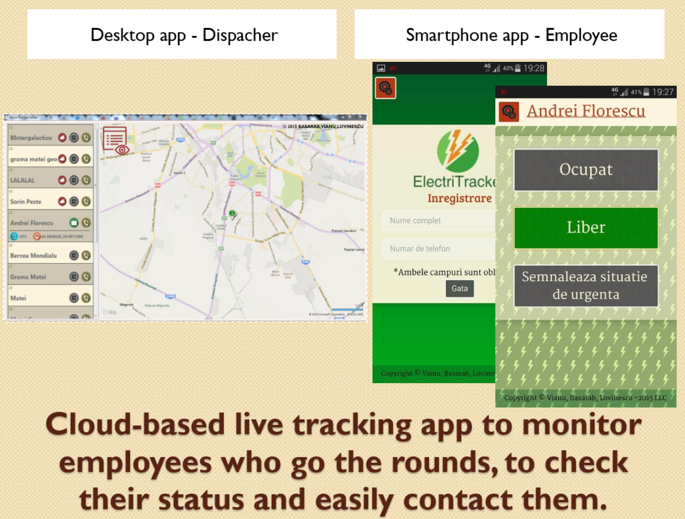

# ElectriTracker

- This is a cloud-based GPS Monitoring solution composed of: a cloud hosted server, a cross-platform mobile application and a Windows app for the dispacher.
- Developed by Andrei Florescu and Matei Grama with great help from Sorin Pește at Microsoft Youthspark Mentorship Program "Oppening Opportunities".

